# Jenkins Docker CI/CD Pipeline

## 1. Project Overview

This project demonstrates the implementation of an end-to-end Continuous Integration and Continuous Deployment (CI/CD) pipeline using Jenkins, Docker and GitHub. The pipeline automates the complete software delivery process, from source code integration to application deployment inside a Docker container.

A Jenkins server is responsible for monitoring the GitHub repository for new commits using GitHub Webhooks. Whenever changes are pushed to the repository, Jenkins automatically checks out the latest source code, builds the Java application using Apache Maven, packages it as a WAR artifact and transfers the generated file to a dedicated Docker host using the Publish Over SSH plugin.

On the Docker host, Jenkins triggers an automated deployment process that rebuilds a custom Apache Tomcat Docker image containing the latest application artifact, removes any previously deployed container and launches a new container running the updated application. This eliminates manual deployment tasks and provides a repeatable, consistent and reliable deployment workflow.

The completed solution demonstrates several core DevOps practices, including Infrastructure Automation, Build Automation, Continuous Integration, Continuous Deployment, Artifact Management and Containerised Application Deployment.

For a detailed guide on how to provision the infrastructure and reproduce this CI/CD pipeline from scratch, see [SETUP.md](SETUP.md).

## 2. Solution Architecture

The solution consists of two Ubuntu EC2 instances deployed within AWS.

- **Jenkins Server**
  - Hosts Jenkins.
  - Performs source code checkout from GitHub.
  - Builds the Java application using Apache Maven.
  - Packages the application into a WAR artifact.
  - Transfers the artifact to the Docker host.
  - Executes remote deployment commands through the Publish Over SSH plugin.

- **Docker Host**
  - Hosts the Docker Engine.
  - Stores the deployment directory under `/opt/docker`.
  - Receives the generated WAR artifact from Jenkins.
  - Builds a custom Apache Tomcat Docker image.
  - Automatically replaces the running application container with the latest version.

The deployment workflow is initiated automatically through a GitHub Webhook whenever code is pushed to the repository, allowing the entire build and deployment process to complete without manual intervention.

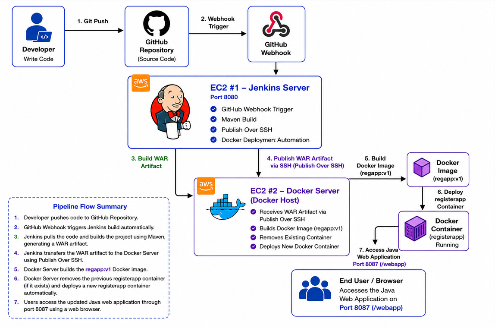

## 3. Infrastructure Overview & Technology Stack

| Component | Configuration |
|-----------|---------------|
| Cloud Provider | Amazon Web Services (AWS) |
| Compute Platform | Amazon EC2 |
| Operating System | Ubuntu Server |
| CI Server | Jenkins |
| Build Tool | Apache Maven 3.9.1 |
| Programming Language | Java |
| Container Platform | Docker |
| Application Server | Apache Tomcat |
| Source Code Repository | GitHub |
| Deployment Method | Publish Over SSH |
| Trigger Mechanism | GitHub Webhook |

The solution combines several DevOps technologies to automate the software delivery lifecycle. GitHub hosts the application source code, Jenkins orchestrates the Continuous Integration and Continuous Deployment pipeline, Apache Maven compiles and packages the application, Docker provides a consistent runtime environment, and Apache Tomcat serves the Java web application. Jenkins communicates securely with the Docker host over SSH and automatically deploys every successful build after receiving a GitHub webhook notification.

### Infrastructure Components

| Server | Purpose |
|---------|----------|
| Jenkins Server | Builds the application, packages the WAR artifact, transfers deployment files and orchestrates the automated deployment process. |
| Docker Host | Builds the custom Docker image and hosts the running Java web application inside an Apache Tomcat container. |

### Network Ports

| Port | Purpose |
|------|----------|
| 22 | SSH remote administration |
| 8080 | Jenkins Web UI |
| 8081–8999 | Application ports (8081 used during initial deployment testing and 8087 used for the final automated deployment) |

### Repository Structure

```text
jenkins-docker-cicd-pipeline/
├── application/
│   ├── pom.xml
│   ├── server/
│   └── webapp/
├── architecture/
│   └── architecture-diagram.png
├── configuration/
├── screenshots/
├── scripts/
│   ├── jenkins.sh
│   └── docker.sh
├── README.md
├── SETUP.md
└── LICENSE
```

The project repository is organised to separate the application source code, deployment scripts, architecture assets, configuration files and project documentation. The `application` directory contains the multi-module Maven project, the `scripts` directory contains the installation scripts used to provision the Jenkins server and Docker host, the `screenshots` directory contains the screenshots captured throughout the implementation process, and the `architecture` directory stores the solution architecture diagram used in this documentation.

## 4. CI/CD Workflow

The automated deployment pipeline follows the workflow below.

1. A developer pushes code changes to the GitHub repository.
2. GitHub sends a webhook notification to Jenkins.
3. Jenkins automatically starts the configured build job.
4. Jenkins checks out the latest source code from GitHub.
5. Apache Maven compiles, tests and packages the application into a WAR artifact.
6. Jenkins transfers the WAR artifact to the Docker host using the Publish Over SSH plugin.
7. Jenkins remotely executes Docker commands on the Docker host.
8. Docker builds a new custom Apache Tomcat image containing the latest application.
9. The existing application container is removed automatically.
10. A new Docker container is created and published on port **8087**.
11. The updated Java web application becomes immediately available through the browser.

This entire workflow is executed automatically whenever new code is pushed to the GitHub repository, providing a fully automated Continuous Integration and Continuous Deployment (CI/CD) pipeline.

## 5. Jenkins Server Provisioning

A dedicated Ubuntu EC2 instance was provisioned to host Jenkins and serve as the Continuous Integration server for the project. The entire installation and configuration process was automated using the Bash script located at [`scripts/jenkins.sh`](scripts/jenkins.sh).

The provisioning process included installing Java 21 (Amazon Corretto), Git, Jenkins, Apache Maven 3.9.1 and all required dependencies. Jenkins was configured with the GitHub Integration and Maven Integration plugins, while both the JDK and Maven installations were registered through the Global Tool Configuration to support automated builds.

Once the installation was complete, Jenkins was made accessible through port **8080**, providing the web interface used to configure build jobs, manage plugins and monitor pipeline executions.

For a complete, step-by-step walkthrough of the Jenkins installation and configuration process, see [SETUP.md](SETUP.md).

### Jenkins Service Verification

The Jenkins service was verified to be running successfully after installation.

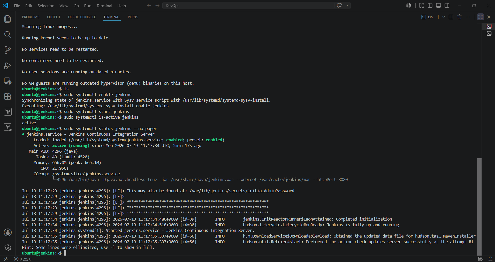

### Jenkins Web Interface

The Jenkins web interface was unlocked using the initial administrator password and configured with the required plugins.

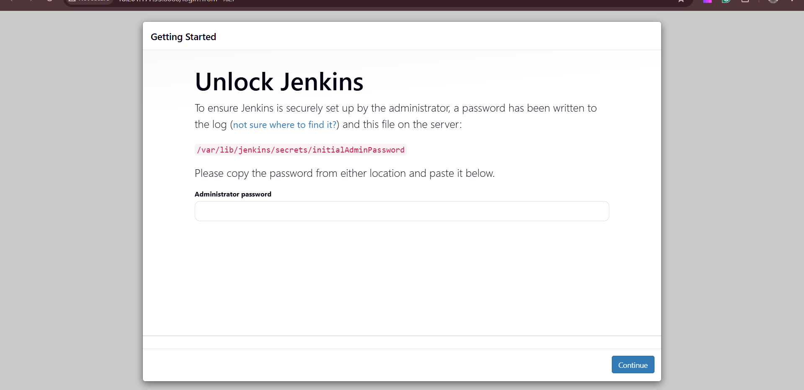

### Jenkins Dashboard

After completing the initial setup, Jenkins displayed the main dashboard, confirming that the CI server was fully operational.

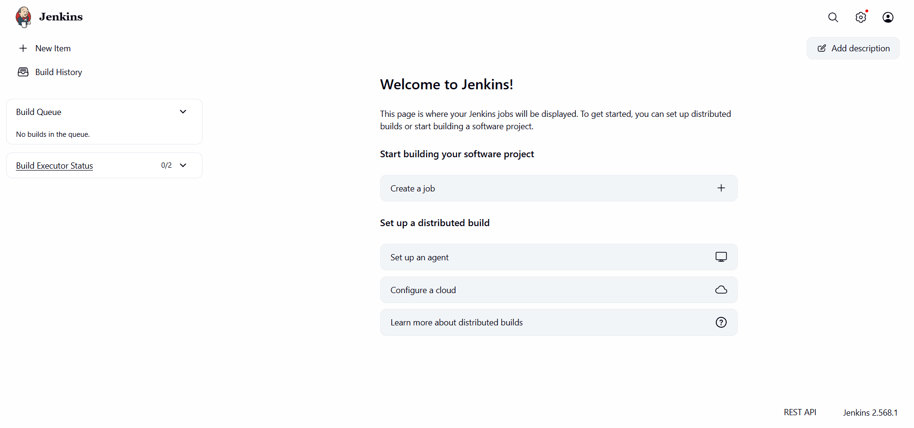

## 6. Git Integration

Git was installed on the Jenkins server to provide version control functionality and enable seamless interaction with GitHub repositories. The project source code is hosted in a dedicated GitHub repository, allowing Jenkins to automatically retrieve the latest application code whenever a build is triggered.

To support Continuous Integration, the GitHub Integration plugin was installed and configured within Jenkins. The build job was linked to the project's GitHub repository using the repository URL, while Git was configured as the source code management tool through Jenkins Global Tool Configuration.

A GitHub webhook was also configured to notify Jenkins immediately after every push to the `main` branch. This eliminated the need for scheduled polling and enabled automatic build execution whenever new code was committed.

For the complete Git installation, plugin configuration and webhook setup, see [SETUP.md](SETUP.md).

## 7. Maven Integration

Apache Maven 3.9.1 was installed on the Jenkins server to automate compilation, dependency management, testing and packaging of the Java application.

After installation, Maven environment variables were configured, and the Maven installation was registered within Jenkins Global Tool Configuration. During every pipeline execution, Jenkins invokes Maven to perform a clean build of the project and package the application into a deployable WAR artifact.

The generated WAR file serves as the deployment package that is transferred to the Docker host during the deployment stage of the pipeline.

For the complete Maven installation and configuration process, see [SETUP.md](SETUP.md).

## 8. Docker Host Provisioning

A separate Ubuntu EC2 instance was provisioned to serve as the Docker host responsible for running the production application container. Separating the Docker runtime from the Jenkins server provides better isolation between build and deployment environments while following common CI/CD architecture practices.

Docker Engine was installed and verified on the server before downloading the official Apache Tomcat image from Docker Hub. An initial Tomcat container was deployed to validate that Docker was functioning correctly and that the required ports were accessible externally.

During testing, the default Tomcat image displayed an HTTP 404 page because recent Tomcat images store the default applications inside the `webapps.dist` directory. This behaviour was resolved by copying the contents of `webapps.dist` into the active `webapps` directory, restoring the standard Tomcat landing page and providing a suitable base image for the custom deployment process implemented later in the project.

A dedicated deployment user named **dockeradmin** was also created on the Docker host. This user was granted Docker privileges and configured for passwordless SSH authentication from the Jenkins server, allowing Jenkins to securely perform automated deployments without requiring interactive authentication.

For the complete Docker installation, Tomcat configuration and deployment user setup, see [SETUP.md](SETUP.md).

### Docker Installation Verification

Docker Engine was successfully installed and verified on the deployment server.

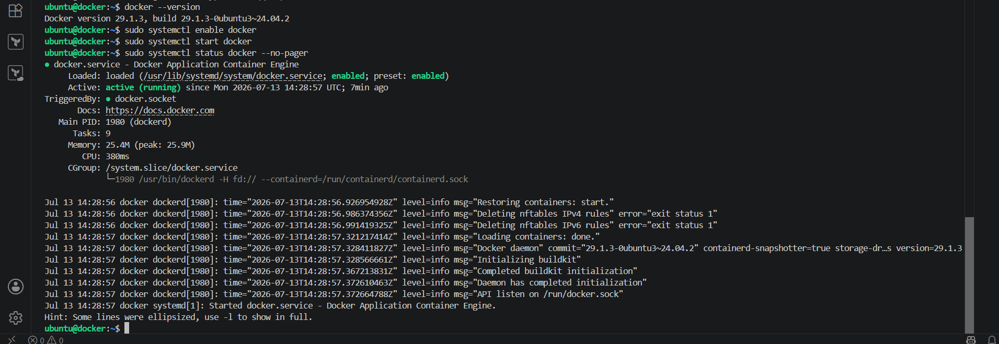

### Apache Tomcat Container

The official Apache Tomcat container was deployed successfully to validate the Docker runtime environment.

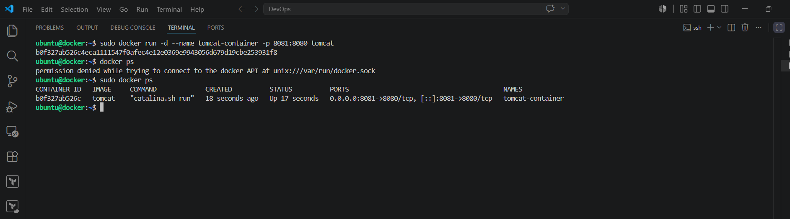

### Apache Tomcat Landing Page

After resolving the default `webapps.dist` configuration, the Tomcat landing page was successfully displayed.

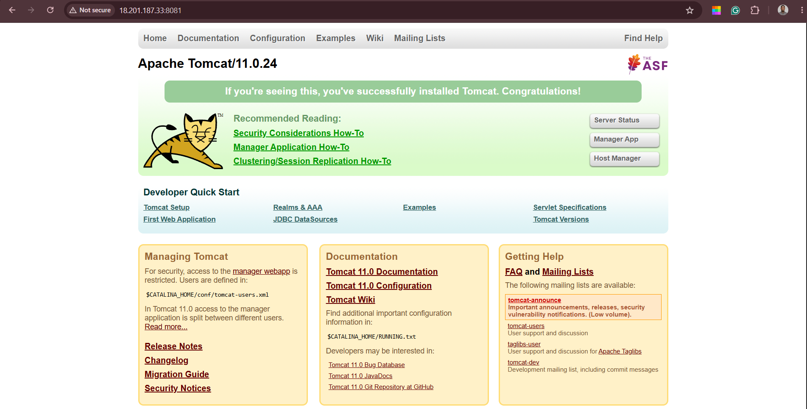

### Docker Deployment User

A dedicated **dockeradmin** user was configured to receive deployments from Jenkins over SSH.

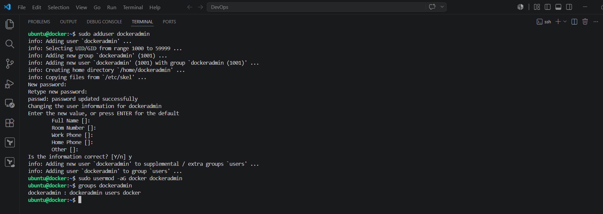

## 9. Jenkins–Docker Integration

To automate application deployment, Jenkins was integrated with the Docker host using the **Publish Over SSH** plugin. This integration enables Jenkins to securely transfer deployment artifacts and execute remote deployment commands after every successful build.

A dedicated SSH server configuration named **dockerhost** was created within Jenkins using the **dockeradmin** deployment account. Passwordless SSH authentication was configured using public key authentication, allowing Jenkins to communicate securely with the Docker host without requiring manual intervention.

The Jenkins job was configured to transfer the generated WAR artifact to the `/opt/docker` directory on the Docker host, where the Dockerfile and deployment resources are stored. After the artifact transfer completed successfully, Jenkins remotely executed Docker commands to build a new application image and deploy a fresh container.

This integration forms the bridge between the Continuous Integration and Continuous Deployment stages of the pipeline.

### SSH Server Configuration

A secure SSH connection was configured between Jenkins and the Docker host.

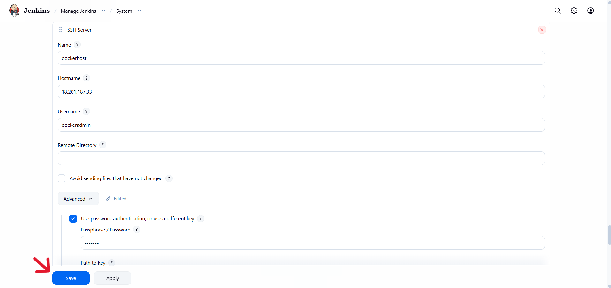

### Publish Over SSH Configuration

The deployment job was configured to transfer the WAR artifact and execute remote deployment commands.

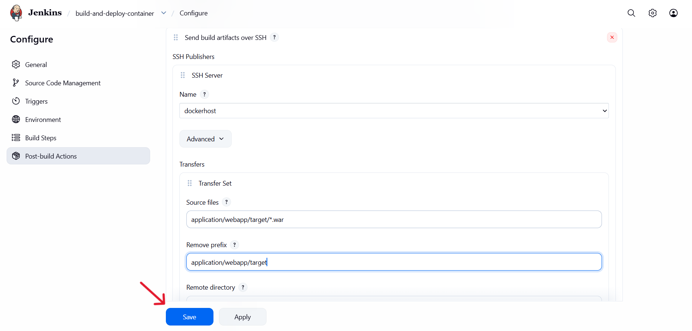

For the complete SSH configuration and Publish Over SSH setup, see [SETUP.md](SETUP.md).

## 10. Jenkins Build Job

A Freestyle Jenkins job named **build-and-deploy-container** was created to automate the complete build and deployment workflow.

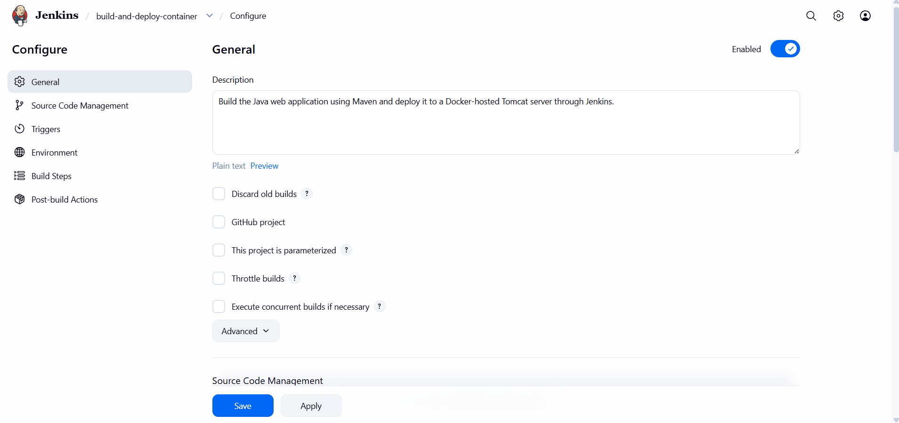

The job retrieves the latest source code from GitHub, compiles the application using Apache Maven, packages the project into a WAR artifact and publishes the artifact to the Docker host. Build execution is triggered automatically through a GitHub webhook whenever new code is pushed to the repository.

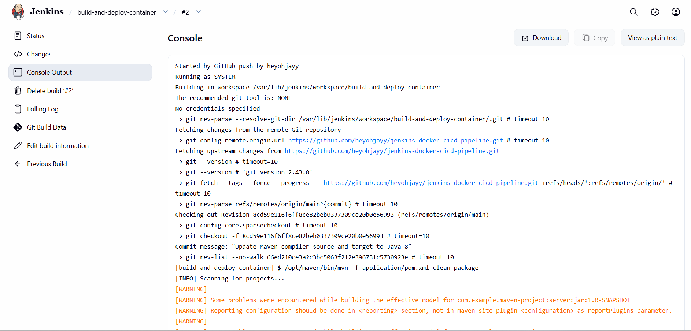

The build configuration also includes a post-build action that transfers the generated WAR file to the Docker host before initiating the deployment stage.

For the complete Jenkins job configuration, see [SETUP.md](SETUP.md).

## 11. Custom Docker Image Deployment

Rather than deploying the WAR file into an already running Tomcat container, the deployment process builds a brand-new Docker image for every successful build. This approach ensures that every deployment is reproducible and produces an immutable application image. The deployment commands build the Docker image, remove any existing application container and launch a new container automatically using the latest application artifact.

A custom Dockerfile copies the generated WAR artifact into the Tomcat `webapps` directory while also restoring the default Tomcat applications from `webapps.dist`. Jenkins transfers the latest WAR artifact to the Docker host before Docker builds the updated image.

Each deployment removes any previously running application container before launching a new container from the latest image on port **8087**, ensuring that the application always runs the newest version.

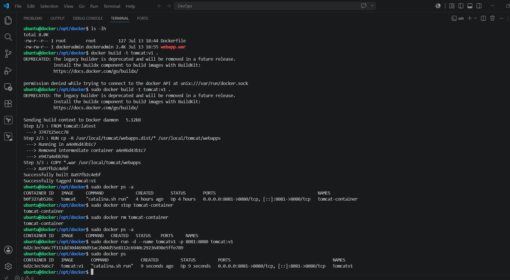

### Java Web Application

The application was successfully deployed inside the custom Tomcat container.

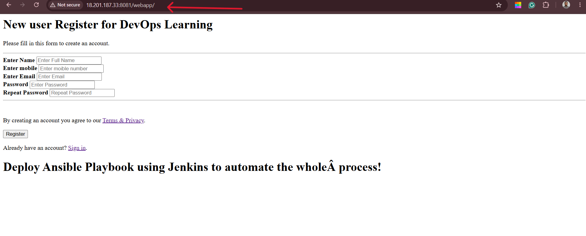

For the complete Docker deployment configuration, see [SETUP.md](SETUP.md).


## 12. Fully Automated Build and Deployment

The final stage of the project combines all previously configured components into a fully automated Continuous Integration and Continuous Deployment pipeline.

Whenever code is pushed to GitHub, the configured webhook immediately triggers Jenkins. Jenkins retrieves the latest source code, performs a Maven build, packages the application, transfers the WAR artifact to the Docker host, builds a new Docker image and deploys a fresh application container automatically. No manual intervention is required at any stage of the deployment process.

The completed pipeline demonstrates an end-to-end automated deployment workflow using Jenkins, GitHub, Apache Maven, Docker and Apache Tomcat running across multiple Amazon EC2 instances.

### Automated Deployment Configuration

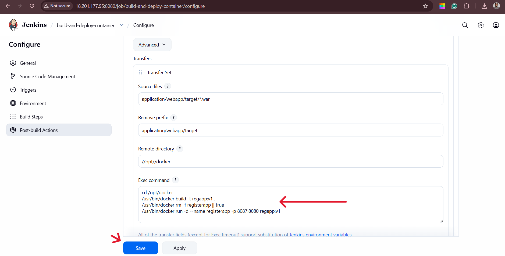

### Automated Build and Deployment

The Jenkins pipeline successfully completed the automated build and deployment process.

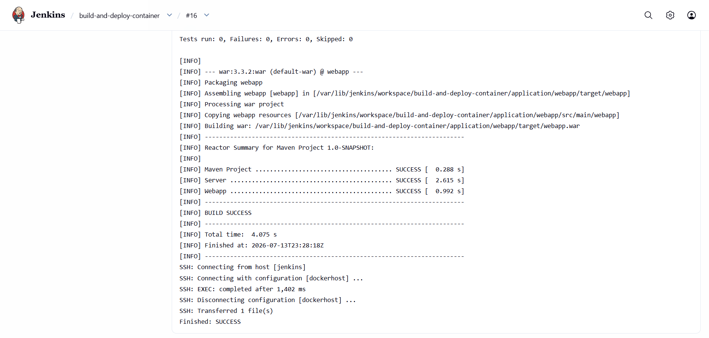

### Docker Image and Container Verification

The latest Docker image and running application container were successfully created after deployment.

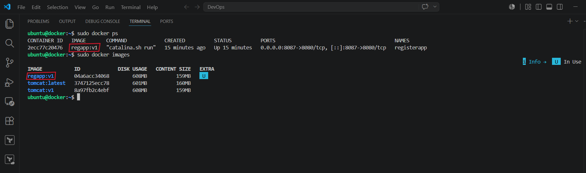

### Final Application Verification

The Java web application was successfully deployed automatically and accessed through the Docker host on port **8087**.

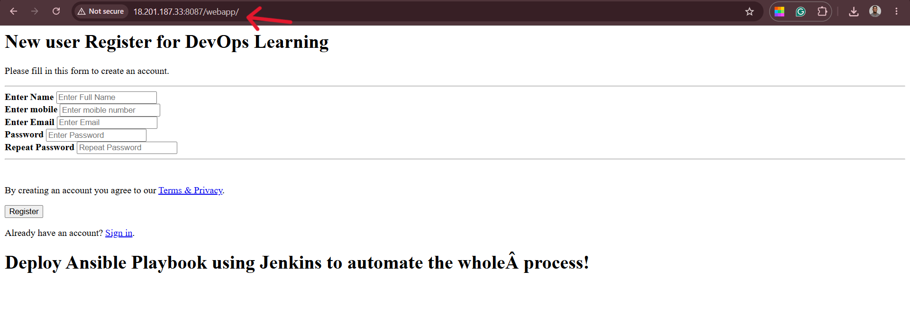

## Conclusion

This project demonstrates the implementation of a fully automated Continuous Integration and Continuous Deployment (CI/CD) pipeline for a Java web application using Jenkins, GitHub, Apache Maven, Docker and Apache Tomcat on Amazon Web Services (AWS). By integrating source control, automated builds, artifact packaging and containerised deployment, the pipeline eliminates manual deployment tasks while ensuring consistent, reliable and repeatable application releases.

The project also showcases practical DevOps concepts including infrastructure provisioning, build automation, webhook integration, secure SSH-based deployments, Docker image creation and automated container lifecycle management.

For the complete step-by-step implementation guide, refer to [SETUP.md](SETUP.md).

## Author

**Ohjayy**
Infrastructure Automation & DevOps Engineer

- GitHub: https://github.com/heyohjayy
- LinkedIn: https://linkedin.com/in/godspowerojeifo

## License

This project is licensed under the MIT License. See the [LICENSE](LICENSE) file for details.
