# End-to-End Java CI/CD Pipeline using Jenkins, Docker & GitHub

This guide provides a complete walkthrough for provisioning the infrastructure and configuring an automated CI/CD pipeline that builds a Java web application with Jenkins, transfers the generated WAR artifact to a Docker host, automatically builds a custom Tomcat Docker image, and deploys the application without manual intervention.

Upon completion of this guide, every commit pushed to the GitHub repository will automatically trigger Jenkins, build the Maven project, publish the WAR artifact to the Docker server, create a new Docker image, replace the running container, and deploy the updated application.

For an overview of the completed solution and its architecture, see the [README.md](README.md).

# Prerequisites

Before beginning this guide, ensure you have the following:

- AWS Account
- GitHub Account
- Basic Linux command-line knowledge
- SSH client
- Git installed on your local machine
- A Java application repository hosted on GitHub

# Infrastructure Deployment

Provision the following AWS EC2 instances before beginning the setup.

| Server | Instance Type | Operating System | Storage | Security Group |
|---------|---------------|------------------|---------|----------------|
| Jenkins Server | t2.medium | Ubuntu Server 24.04 LTS | 20 GB gp3 | SSH (22), HTTP (8080) |
| Docker Server | t2.medium | Ubuntu Server 24.04 LTS | 20 GB gp3 | SSH (22), HTTP (8081–8999) |

After launching both EC2 instances, connect to each server using SSH before proceeding.

# 1. Jenkins Server Setup

This section provisions Jenkins on the Ubuntu server and performs the initial configuration required before integrating Git, Maven and Docker.

## 1.1 Connect to the Jenkins Server

SSH into the Jenkins EC2 instance.

```bash
ssh -i <your-key.pem> ubuntu@<JENKINS_PUBLIC_IP>
```

## 1.2 Install Jenkins

The project uses the automated installation script provided in the repository.

Run:

```bash
chmod +x scripts/jenkins.sh
./scripts/jenkins.sh
```

The script installs and configures:

- Java
- Jenkins
- Required dependencies
- Jenkins system service

Verify that Jenkins is installed successfully.

```bash
java -version
```

```bash
jenkins --version
```

Verify that the Jenkins service is running.

```bash
sudo systemctl status jenkins --no-pager
```

The service should report an **active (running)** status.


## 1.3 Access the Jenkins Web Interface

Retrieve the public IP address of the Jenkins server.

```bash
curl ifconfig.me
```

Open the Jenkins web interface.

```text
http://<JENKINS_PUBLIC_IP>:8080
```

The Jenkins Unlock page should be displayed.


## 1.4 Unlock Jenkins

Retrieve the initial administrator password.

```bash
sudo cat /var/lib/jenkins/secrets/initialAdminPassword
```

Copy the generated password.

Paste it into the Jenkins Unlock screen and continue.

## 1.5 Install Suggested Plugins

When prompted, select:

**Install suggested plugins**

Jenkins automatically downloads and installs the recommended plugins required for normal operation.

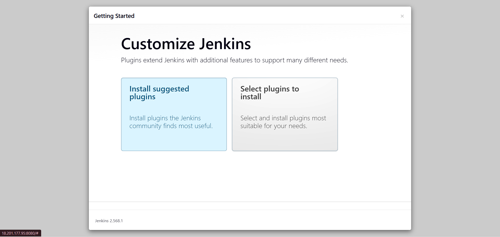

Wait until all plugins finish installing before continuing.

## 1.6 Create the Administrator Account

Create your first Jenkins administrator account.

Configure:

- Username
- Password
- Full Name
- Email Address

Click **Save and Continue**.

After completing the initial configuration, Jenkins redirects to the dashboard.


At this point, the Jenkins server has been successfully provisioned and is ready for Git integration.

# 2. Git Integration

Git enables Jenkins to clone the application source code from GitHub whenever a build is triggered. During this phase, Git is installed on the Jenkins server, the required Jenkins Git plugins are configured, and Git is integrated with Jenkins.

## 2.1 Install Git

Install Git on the Jenkins server.

```bash
sudo apt update
sudo apt install git -y
```

Verify the installation.

```bash
git --version
```

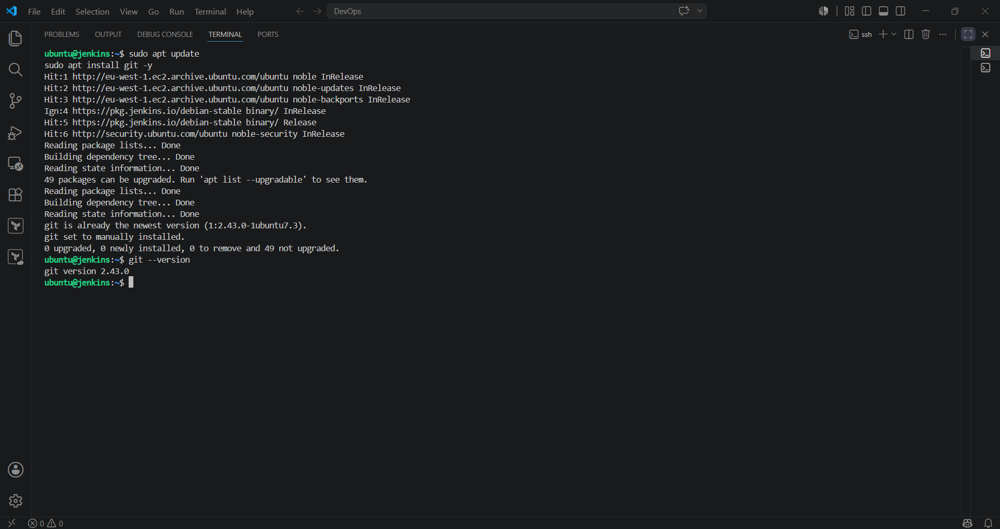

## 2.2 Install the Git Integration Plugin

From the Jenkins Dashboard, navigate to:

- **Manage Jenkins**
- **Plugins**
- **Available Plugins**

Search for:

- **Git Integration**

Install the plugin and wait for the installation to complete.

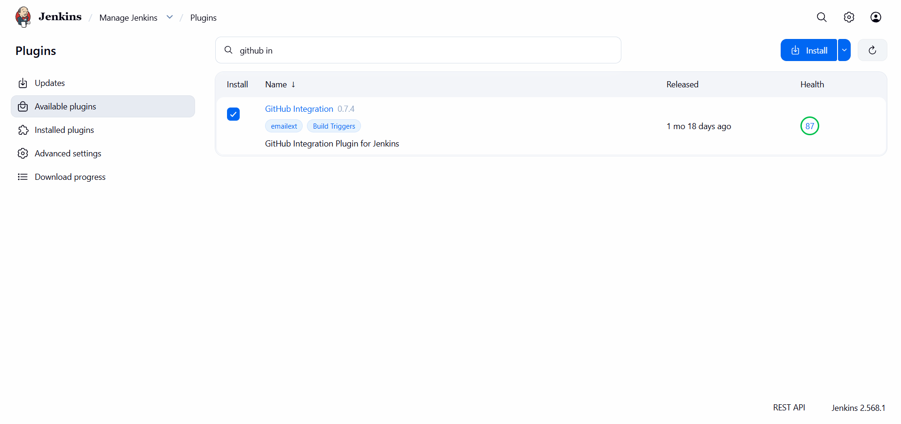

## 2.3 Configure Git in Jenkins

Navigate to:

- **Dashboard**
- **Manage Jenkins**
- **Tools**

Locate the **Git Installations** section.

Configure the following:

**Name**

```text
Git
```

**Path to Git executable**

```text
git
```

Click **Apply**, then **Save**.

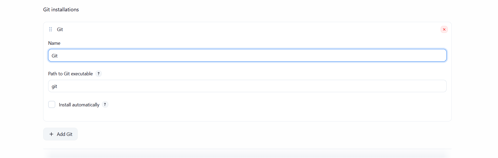

Git is now fully configured and available for Jenkins build jobs.

# 3. Maven Integration

Apache Maven is used by Jenkins to compile the Java application, execute unit tests, and package the application into a deployable WAR artifact. During this phase, Maven is installed manually, the required environment variables are configured, the Java Development Kit (JDK) is installed, and both Java and Maven are registered inside Jenkins.

## 3.1 Install Apache Maven

Switch to the `/opt` directory.

```bash
cd /opt
```

Download Apache Maven 3.9.1.

```bash
sudo wget https://archive.apache.org/dist/maven/maven-3/3.9.1/binaries/apache-maven-3.9.1-bin.tar.gz
```

Extract the archive.

```bash
sudo tar -xvzf apache-maven-3.9.1-bin.tar.gz
```

Rename the extracted directory.

```bash
sudo mv apache-maven-3.9.1 maven
```

Verify that Maven has been extracted successfully.

```bash
ls -la /opt
```

## 3.2 Configure Maven Environment Variables

Edit the user's Bash profile.

```bash
vi ~/.bash_profile
```

Add the following configuration.

```text
M2_HOME=/opt/maven
M2=/opt/maven/bin
JAVA_HOME=/usr/lib/jvm/java-21-openjdk-amd64

PATH=$PATH:$HOME/bin:$JAVA_HOME:$M2_HOME:$M2

export PATH
```

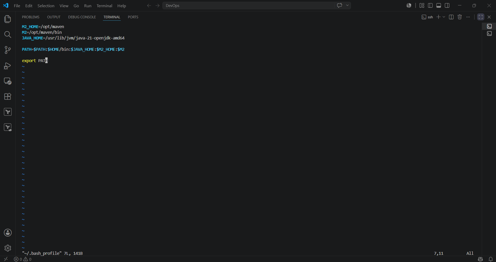

Save the file (esc + :wq) then reload the environment variables:

```bash
source ~/.bash_profile
```

## 3.3 Install the Java Development Kit (JDK)

Update the package repository.

```bash
sudo apt update
```

Install OpenJDK 21.

```bash
sudo apt install openjdk-21-jdk -y
```

Verify the Java installation.

```bash
java -version
```

## 3.4 Verify the Maven Installation

Confirm that Maven has been installed successfully.

```bash
mvn -version
```

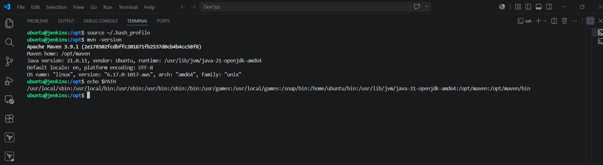

## 3.5 Install the Maven Integration Plugin

From the Jenkins Dashboard, navigate to:

- **Manage Jenkins**
- **Plugins**
- **Available Plugins**

Search for:

- **Maven Integration**

Install the plugin and restart Jenkins if prompted.

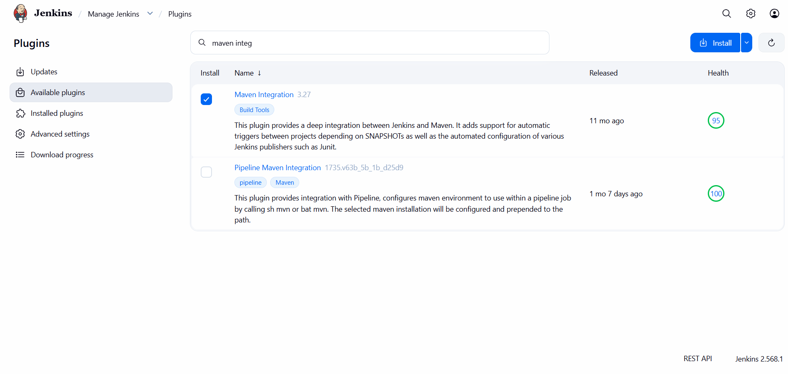

## 3.6 Configure Java and Maven in Jenkins

Navigate to:

- **Dashboard**
- **Manage Jenkins**
- **Tools**

Under **JDK Installations**, configure:

**Name**

```text
Java-21
```

**JAVA_HOME**

```text
/usr/lib/jvm/java-21-openjdk-amd64
```

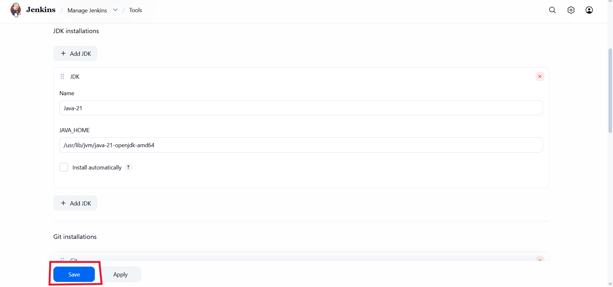

Under **Maven Installations**, configure:

**Name**

```text
Maven3.9.1
```

**MAVEN_HOME**

```text
/opt/maven
```

Click **Apply**, then **Save**.

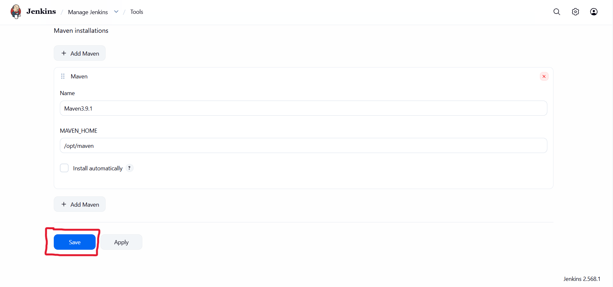

At this stage, Jenkins has been fully configured with Java 21 and Apache Maven, enabling it to compile, test, and package Java applications for subsequent deployment stages.

# 4. Docker Host Provisioning

The Docker host serves as the deployment server for the Java web application. During this phase, Docker is installed and configured, the official Apache Tomcat Docker image is downloaded, and a Tomcat container is deployed to host the application. The default Tomcat image is then configured to expose the standard web applications before verifying successful deployment.

## 4.1 Install Docker

Update the package repository and Install Docker.

```bash
sudo apt update
sudo apt install docker.io -y
```

Verify the installation.

```bash
docker --version
```

## 4.2 Enable and Start the Docker Service

Enable Docker to start automatically during system boot.

```bash
sudo systemctl enable docker
```

Start the Docker service.

```bash
sudo systemctl start docker
```

Verify that the Docker service is running.

```bash
sudo systemctl status docker --no-pager
```


## 4.3 Download the Apache Tomcat Docker Image

Download the latest Apache Tomcat image from Docker Hub.

```bash
sudo docker pull tomcat
```

Verify that the image has been downloaded successfully.

```bash
sudo docker images
```

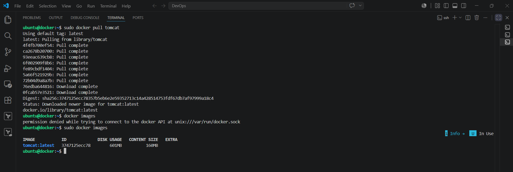

## 4.4 Create a Tomcat Container

Create and start a Tomcat container.

```bash
docker run -d --name tomcat-container -p 8081:8080 tomcat
```

Verify that the container is running.

```bash
sudo docker ps
```


## 4.5 Verify the Initial Tomcat Deployment

Open the following URL in a web browser.

```text
http://<DOCKER_PUBLIC_IP>:8081
```

At this stage, the browser should display a **404 Not Found** page. This behaviour is expected because the official Apache Tomcat Docker image stores the default applications inside the `webapps.dist` directory, while the `webapps` directory is initially empty.

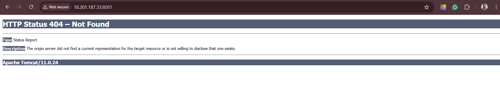

## 4.6 Fix the Tomcat 404 Issue

Access the running Tomcat container.

```bash
sudo docker exec -it tomcat-container /bin/bash
```

Navigate to the Tomcat installation directory.

```bash
cd /usr/local/tomcat
```

Copy the default web applications into the active deployment directory.

```bash
cp -R webapps.dist/* webapps
```

Verify that the files have been copied successfully.

```bash
ls webapps
```

Exit the container.

```bash
exit
```

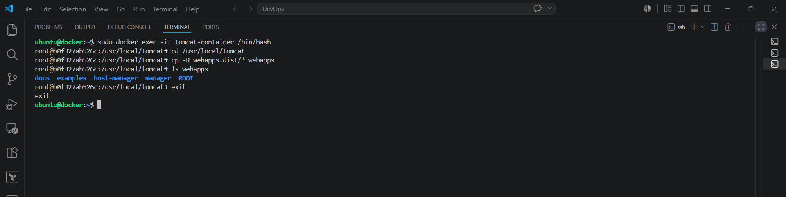

## 4.7 Verify the Tomcat Landing Page

Refresh the browser.

```text
http://<DOCKER_PUBLIC_IP>:8081
```

The default Apache Tomcat landing page should now load successfully, confirming that the Docker container has been configured correctly and is ready to host Java web applications.


# 5. Jenkins–Docker Integration

In this phase, a dedicated deployment user is created on the Docker server to allow Jenkins to securely transfer build artifacts and execute deployment commands remotely using SSH. Jenkins is then configured with the Publish Over SSH plugin to establish communication with the Docker host.

## 5.1 Create the Deployment User

Create a dedicated deployment user on the Docker server.

```bash
sudo adduser dockeradmin
```

Add the user to the Docker group so it can manage Docker containers without requiring sudo privileges.

```bash
sudo usermod -aG docker dockeradmin
```

Verify that the user has been added to the Docker group.

```bash
groups dockeradmin
```


## 5.2 Enable SSH Password Authentication

Edit the main SSH configuration file.

```bash
sudo vi /etc/ssh/sshd_config
```

Update the following configuration.

```text
PasswordAuthentication yes
#PermitEmptyPasswords no
#PasswordAuthentication no
```

## 5.3 Check SSH Configuration Overrides

Some Ubuntu cloud images override the main SSH configuration using files inside the `sshd_config.d` directory.

List the override files.

```bash
ls -la /etc/ssh/sshd_config.d/
```

View the active configuration.

```bash
cat /etc/ssh/sshd_config.d/60-cloudimg-settings.conf
```

Edit the override file.

```bash
sudo vi /etc/ssh/sshd_config.d/60-cloudimg-settings.conf
```

Change:

```text
PasswordAuthentication no
```

To:

```text
PasswordAuthentication yes
```

Restart the SSH service.

```bash
sudo systemctl restart ssh
```

## 5.4 Verify SSH Password Authentication

From your local machine, verify that password authentication is working by connecting to the Docker server using the newly created deployment account.

```bash
ssh dockeradmin@<DOCKER_PUBLIC_IP>
```

Successfully logging in confirms that Jenkins will be able to authenticate using the same credentials.

## 5.5 Install the Publish Over SSH Plugin

From the Jenkins Dashboard, navigate to:

- **Manage Jenkins**
- **Plugins**
- **Available Plugins**

Search for:

- **Publish Over SSH**

Install the plugin and restart Jenkins if prompted.

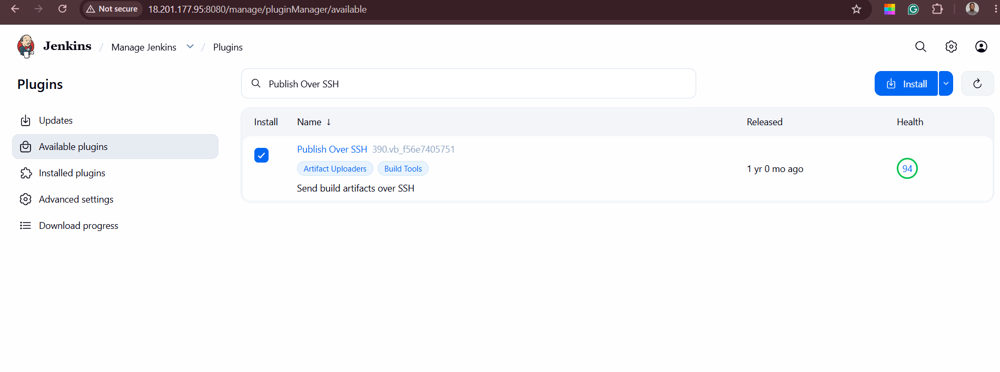

## 5.6 Configure the Docker SSH Server in Jenkins

Navigate to:

- **Dashboard**
- **Manage Jenkins**
- **System**

Scroll to the **SSH Servers** section and configure the following settings.

| Setting | Value |
|----------|-------|
| Name | dockerhost |
| Hostname | `<DOCKER_PUBLIC_IP>` |
| Username | dockeradmin |
| Remote Directory | *(Leave blank)* |

Click **Advanced** and enable:

- **Use password authentication, or use a different key**

Provide the **dockeradmin** account password.

Click **Test Configuration** to verify the connection.

A successful test confirms that Jenkins can communicate with the Docker server over SSH.

Click **Save**.


The Jenkins server is now securely connected to the Docker host and ready to transfer application artifacts and execute remote deployment commands.

# 6. Jenkins Build Job Configuration

In this phase, a Jenkins Freestyle project is created to automate the build process. The job is configured to retrieve the application source code from GitHub, compile it using Apache Maven, transfer the generated WAR artifact to the Docker server, and automatically trigger new builds whenever changes are pushed to the repository.

## 6.1 Create the Jenkins Build Job

From the Jenkins Dashboard, navigate to:

- **Dashboard**
- **New Item**

Configure the following:

| Setting | Value |
|----------|-------|
| Name | build-and-deploy-container (or any name of your choice)|
| Type | Freestyle Project |

Click **OK**.

Under the **General** section, provide a project description.

Example:

```text
Build code with the help of Maven and deploy it on Docker Container.
```

Click **Apply**.


## 6.2 Configure Source Code Management

Navigate to:

- **Source Code Management**
- **Git**

Configure the repository details.

| Setting | Value |
|----------|-------|
| Repository URL | https://github.com/<github username>/<repo name>.git (repo with your source code)|
| Branch | */main |
| Credentials | None (Public Repository). If you are using a private repository then you'll need to create a global credential. |

Click **Apply**.

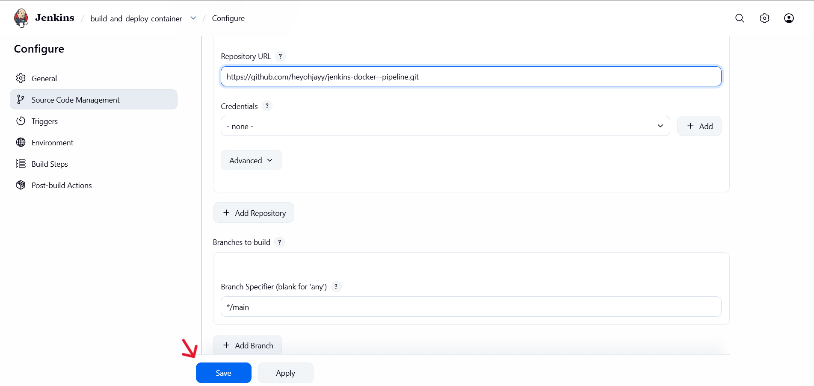

## 6.3 Configure the Build Trigger

Navigate to:

- **Build Triggers**

Enable:

- **GitHub hook trigger for GITScm polling**

This allows GitHub to automatically notify Jenkins whenever a new commit is pushed to the repository, eliminating the need to manually start builds.

## 6.4 Configure the Build Step

Navigate to:

- **Build**
- **Add Build Step**
- **Invoke top-level Maven targets**

Configure the build step.

| Setting | Value |
|----------|-------|
| Maven Version | Maven3.9.1 |
| Goals | clean package |
| Root POM | application/pom.xml |

Click **Apply**.

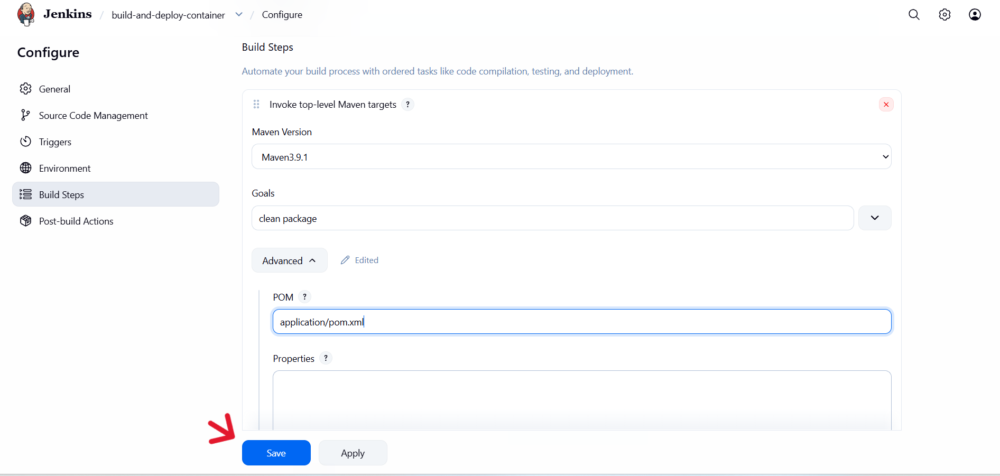

## 6.5 Configure the Post-build Action

Navigate to:

- **Post-build Actions**
- **Add Post-build Action**
- **Send files or execute commands over SSH**

Configure the transfer settings.

**SSH Server**

```text
dockerhost
```

**Transfer Set**

| Setting | Value |
|----------|-------|
| Source files | application/webapp/target/*.war |
| Remove prefix | application/webapp/target |
| Remote directory | /home/dockeradmin |

Click **Apply**, then **Save**.


## 6.6 Configure the GitHub Webhook

Navigate to the GitHub repository.

- **Settings**
- **Webhooks**
- **Add webhook**

Configure the webhook.

| Setting | Value |
|----------|-------|
| Payload URL | http://<JENKINS_PUBLIC_IP>:8080/github-webhook/ |
| Content type | application/json |
| Secret | Leave blank |
| SSL Verification | Disable |
| Events | Just the push event |
| Active | Enabled |

Example Payload URL:

```text
http://18.201.177.95:8080/github-webhook/
```

Click **Add webhook**.

## 6.7 Verify Automatic Build Trigger

Make a small change to the repository and push it to GitHub.

```bash
git add .
git commit -m "Configure Jenkins build pipeline"
git push origin main
```

Verify the following:

- GitHub reports a successful webhook delivery.
- Jenkins automatically starts a new build.
- No manual **Build Now** action is required.


## 6.8 Verify WAR Artifact Transfer

After the build completes successfully, connect to the Docker server.

```bash
ssh dockeradmin@<DOCKER_PUBLIC_IP>
```

Navigate to the deployment directory.

```bash
cd /home/dockeradmin
```

Verify that the WAR artifact has been transferred.

```bash
ls
```

Or display detailed file information.

```bash
ls -lh
```

Confirm that the following file is present.

```text
webapp.war
```

The presence of the WAR file confirms that Jenkins successfully compiled the application and securely transferred the build artifact to the Docker host using the Publish Over SSH plugin.

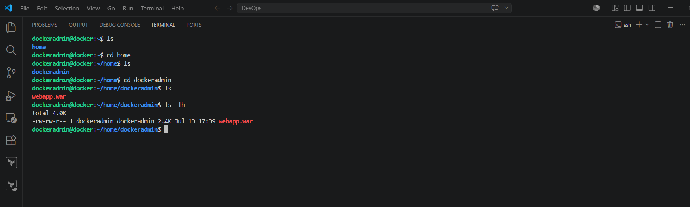

# 7. Custom Docker Image Deployment

In this phase, the deployment workflow is updated to use a custom Docker image instead of the default Apache Tomcat image. A custom Dockerfile is created to package the Java web application automatically, Jenkins is reconfigured to transfer the build artifact into the new deployment directory, and a new Tomcat container is launched using the custom image.

## 7.1 Create the Docker Deployment Directory

Connect to the Docker server.

```bash
ssh ubuntu@<DOCKER_PUBLIC_IP>
```

Navigate to the `/opt` directory.

```bash
cd /opt
```

Create a new deployment directory.

```bash
sudo mkdir docker
```

Assign ownership of the directory to the `dockeradmin` user.

```bash
sudo chown -R dockeradmin:dockeradmin /opt/docker
```

Verify the directory ownership.

```bash
ls -ld /opt/docker
```

Navigate to the deployment directory.

```bash
cd /opt/docker
```

## 7.2 Create the Dockerfile

Create a new Dockerfile.

```bash
sudo vi Dockerfile
```

Add the following configuration.

```dockerfile
FROM tomcat:latest
RUN cp -R /usr/local/tomcat/webapps.dist/* /usr/local/tomcat/webapps
COPY *.war /usr/local/tomcat/webapps
```

Save and close the editor.

Verify that the Dockerfile has been created successfully.

```bash
ls -lh
```

```bash
cat Dockerfile
```

## 7.3 Update the Jenkins Deployment Directory

Navigate to:

- **Dashboard**
- **build-and-deploy-container**
- **Configure**
- **Post-build Actions**
- **Send files or execute commands over SSH**

Update the following setting.

| Setting | Value |
|----------|-------|
| Remote directory | //opt//docker |

Leave the following settings unchanged.

| Setting | Value |
|----------|-------|
| SSH Server | dockerhost |
| Source files | application/webapp/target/*.war |
| Remove prefix | application/webapp/target |

Click **Apply**, then **Save**.

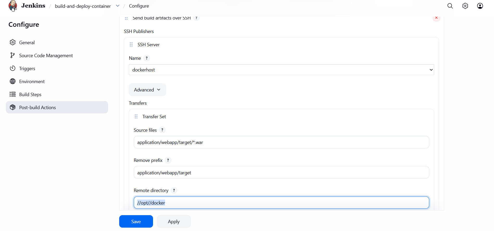

## 7.4 Verify WAR Artifact Transfer

Trigger a new Jenkins build by pushing a change to the repository.

```bash
git add .
git commit -m "Update deployment directory"
git push origin main
```

After the build completes successfully, connect to the Docker server.

```bash
ssh ubuntu@<DOCKER_PUBLIC_IP>
```

Navigate to the deployment directory.

```bash
cd /opt/docker
```

Verify that Jenkins transferred both required files.

```bash
ls -lh
```

Expected output:

```text
Dockerfile
webapp.war
```

The presence of both files confirms that Jenkins successfully transferred the application artifact into the Docker build context.

## 7.5 Build the Custom Docker Image

Build the custom Tomcat image.

```bash
sudo docker build -t tomcat:v1 .
```

Verify that the image was created successfully.

```bash
sudo docker images
```

## 7.6 Replace the Existing Tomcat Container

Check whether an existing Tomcat container is running.

```bash
sudo docker ps -a
```

Stop the existing container.

```bash
sudo docker stop tomcat-container
```

Remove the container.

```bash
sudo docker rm tomcat-container
```

Verify that it has been removed.

```bash
sudo docker ps -a
```

## 7.7 Deploy the Custom Docker Container

Launch a new container using the custom Docker image.

```bash
sudo docker run -d --name tomcatv1 -p 8081:8080 tomcat:v1
```

Verify that the container is running.

```bash
sudo docker ps
```


## 7.8 Verify the Java Web Application

Open the deployed application in a web browser.

```text
http://<DOCKER_PUBLIC_IP>:8081/webapp/
```

Confirm that the Java web application loads successfully from the custom Docker image.


# 8. Fully Automated Build and Deployment

In the final phase of the project, Jenkins is configured to perform the complete deployment process automatically after every successful build. In addition to transferring the generated WAR artifact to the Docker server, Jenkins remotely builds a new Docker image, replaces any existing application container, and deploys the latest version of the application without requiring any manual intervention.

## 8.1 Configure the Automated Deployment Commands

Navigate to:

- **Dashboard**
- **build-and-deploy-container**
- **Configure**
- **Post-build Actions**
- **Send files or execute commands over SSH**

Verify that the existing SSH Publisher configuration contains the following settings.

| Setting | Value |
|----------|-------|
| SSH Server | dockerhost |
| Source files | application/webapp/target/*.war |
| Remove prefix | application/webapp/target |
| Remote directory | //opt//docker |

In the **Exec command** section, input the following deployment commands.

```bash
cd /opt/docker
/usr/bin/docker build -t regapp:v1 .
/usr/bin/docker rm -f registerapp || true
/usr/bin/docker run -d --name registerapp -p 8087:8080 regapp:v1
```

Click **Apply**, then **Save**.


## 8.2 Trigger the Automated Pipeline

Make a small change to the application source code or the project documentation.

Commit and push the changes to GitHub.

```bash
git add .
git commit -m "Trigger automated deployment"
git push origin main
```

The GitHub webhook automatically notifies Jenkins, triggering the pipeline without requiring a manual **Build Now** action.

## 8.3 Verify the Automated Build

Open the Jenkins job and monitor the **Console Output**.

Confirm that the pipeline completes the following tasks successfully:

- Builds the Maven project.
- Generates the WAR artifact.
- Transfers the WAR artifact to the Docker server.
- Automatically builds the `regapp:v1` Docker image.
- Removes the existing `registerapp` container if it already exists.
- Deploys a new `registerapp` container.
- Finishes with **BUILD SUCCESS**.


## 8.4 Verify the Docker Deployment

Connect to the Docker server.

```bash
ssh ubuntu@<DOCKER_PUBLIC_IP>
```

Verify that the application container is running.

```bash
sudo docker ps
```

Verify that the Docker image has been created.

```bash
sudo docker images
```


## 8.5 Verify the Automated Application Deployment

Open the deployed Java web application.

```text
http://<DOCKER_PUBLIC_IP>:8087/webapp/
```

Confirm that the application loads successfully.

Successful access to the application verifies that the CI/CD pipeline is functioning end-to-end. Every new commit pushed to GitHub now automatically triggers a Jenkins build, packages the application with Maven, transfers the generated artifact to the Docker server, rebuilds the Docker image, replaces the running container, and deploys the latest version of the application without any manual deployment steps.


# Common Issues and Troubleshooting

| Issue | Possible Solution |
|--------|-------------------|
| **Jenkins cannot transfer the WAR file to the Docker server.** | Verify that the **Publish Over SSH** configuration is correct. Ensure the SSH server name is `dockerhost`, the `dockeradmin` user exists, SSH password authentication is enabled, and the Jenkins SSH test connection succeeds. |
| **The WAR file is not copied into the expected directory on the Docker server.** | Confirm that the **Remote directory** is configured correctly. When deploying the custom Docker image, it must be set to `//opt//docker`. Using a different directory such as `/home/dockeradmin` will prevent the Docker build from finding the WAR file. |
| **Docker build fails because `webapp.war` cannot be found.** | Verify that Jenkins successfully transferred `webapp.war` into `/opt/docker`. Connect to the Docker server and run `ls -lh /opt/docker` to confirm that both the `Dockerfile` and `webapp.war` are present before building the image. |
| **Tomcat displays a 404 Not Found page after the container starts.** | This is expected with the default Apache Tomcat image because the default applications are stored in `webapps.dist`. Enter the container and copy the contents into the `webapps` directory using `cp -R /usr/local/tomcat/webapps.dist/* /usr/local/tomcat/webapps`. |
| **The automated deployment finishes as UNSTABLE instead of BUILD SUCCESS.** | Verify the commands in the **Exec command** section. The deployment commands should use the full Docker executable path:<br><br>`/usr/bin/docker build -t regapp:v1 .`<br>`/usr/bin/docker rm -f registerapp || true`<br>`/usr/bin/docker run -d --name registerapp -p 8087:8080 regapp:v1` |
| **The deployment fails because the existing container does not exist.** | This is normal during the first deployment. Use `docker rm -f registerapp || true` so Jenkins continues even if the container has not yet been created. |
| **GitHub pushes do not automatically trigger Jenkins builds.** | Confirm that **GitHub hook trigger for GITScm polling** is enabled in the Jenkins job. Also verify that the GitHub Webhook points to `http://<JENKINS_PUBLIC_IP>:8080/github-webhook/` and that recent webhook deliveries report a successful response. |
| **The deployed application cannot be accessed from the browser.** | Verify that the EC2 Security Group allows inbound traffic on ports **8080**, **8081**, and **8087** (or **8081–8999**, depending on your security group configuration). Also confirm that the container is running by executing `sudo docker ps` and that the application is available at `http://<DOCKER_PUBLIC_IP>:8087/webapp/`. |
